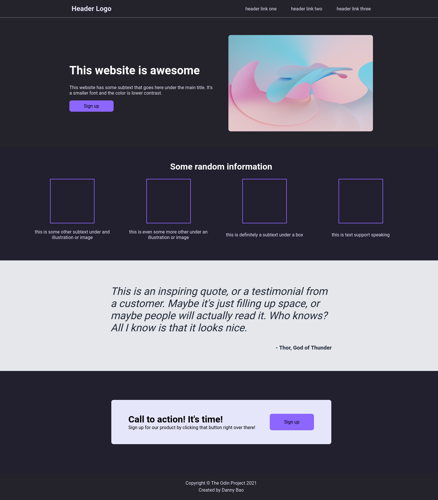

# landing-page

This repo is part of the Odin Project's foundation course, where the task is to create a template landing page made up of HTML and CSS.

Credit: Images by [Pawel Czerwinski](https://unsplash.com/@pawel_czerwinski) on [Unsplash](https://unsplash.com/)

## Screenshot

---

Reflections:
 - Flexbox and Grid both have their places to use, like in the 4 image gallery I used Grid instead of Flexbox for evenly sized boxes regardless of the content size.
 - This is certainly not best practice.
 - How do you get each container div evenly sized between each other?
 - Was fun!
